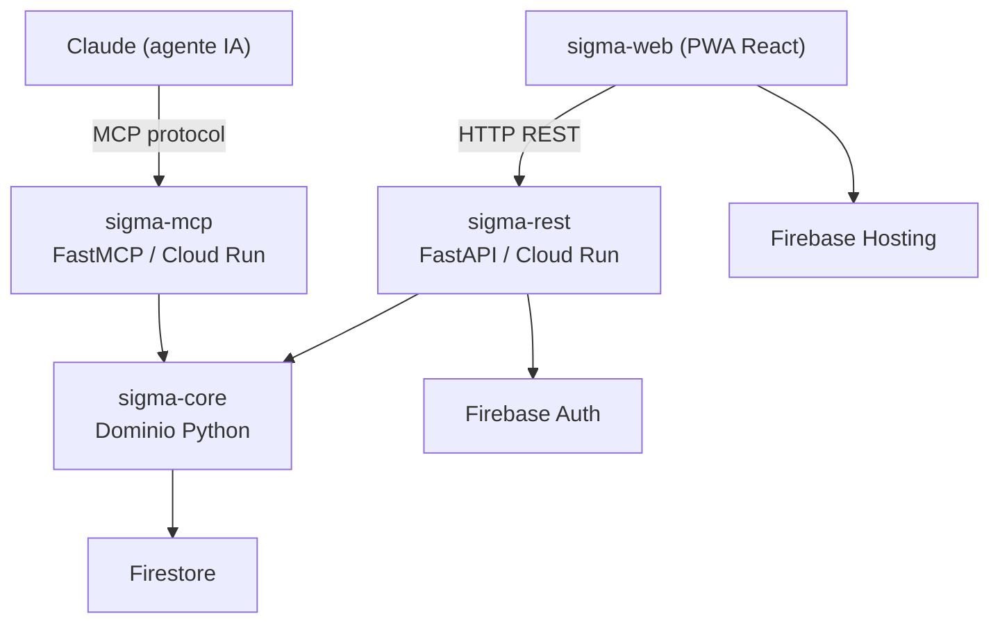
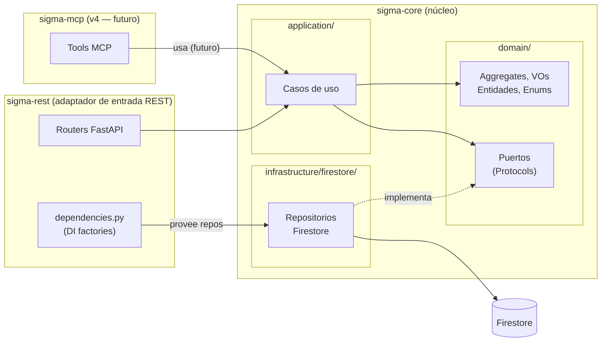
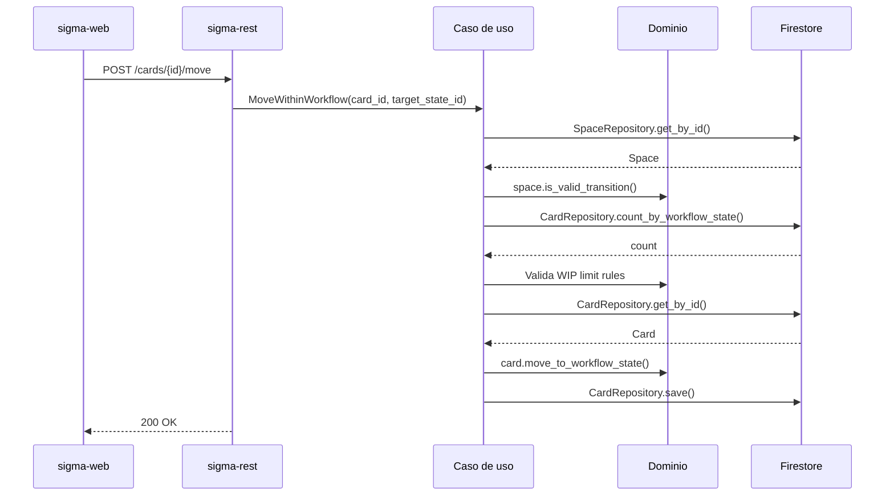
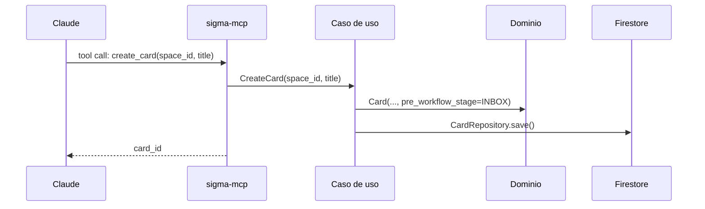
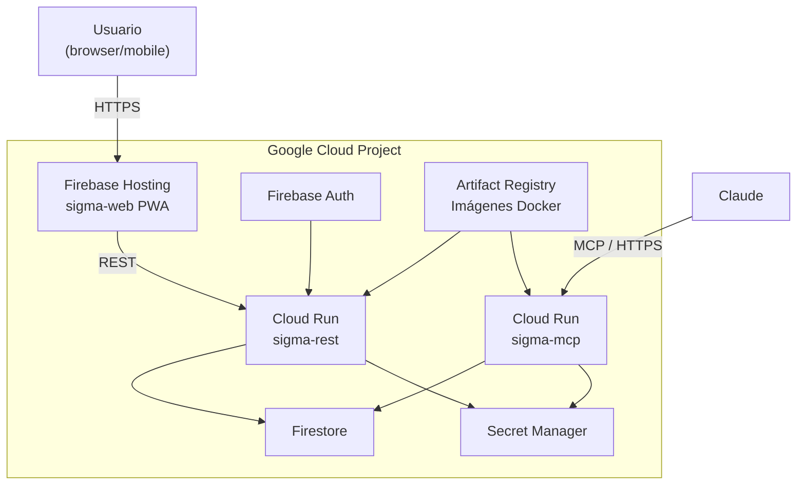

# ARCHITECTURE.md

## SIGMA — Arquitectura del sistema

**Versión:** 1.1
**Fecha:** 2026-04-09
**Estado:** Activo

---

## Índice

1. [Visión general](#1-visión-general)
2. [Principios arquitectónicos](#2-principios-arquitectónicos)
3. [Estructura del repositorio](#3-estructura-del-repositorio)
4. [Bounded Contexts](#4-bounded-contexts)
5. [Capas y dependencias](#5-capas-y-dependencias)
6. [Componentes y responsabilidades](#6-componentes-y-responsabilidades)
7. [Flujo de datos](#7-flujo-de-datos)
8. [Infraestructura GCP](#8-infraestructura-gcp)
9. [Decisiones arquitectónicas](#9-decisiones-arquitectónicas)

---

## 1. Visión general

SIGMA es una aplicación personal de productividad que gestiona tareas mediante un sistema de tablero configurable con workflow de estados. Está diseñada para ser accesible desde un agente de IA (Claude vía MCP) y desde una interfaz web (PWA).



---

## 2. Principios arquitectónicos

### Arquitectura de núcleo centralizado

`sigma-core` contiene tanto el dominio como los adaptadores de salida (repositorios Firestore). `sigma-rest` y `sigma-mcp` son adaptadores de entrada que orquestan los casos de uso pero no implementan persistencia. Esta decisión centraliza los repositorios en el núcleo para evitar duplicación cuando múltiples adaptadores de entrada comparten el mismo backend (ADR-014).

```
[Adaptadores de entrada]    →   [Casos de uso]  →  [Dominio]
sigma-rest (REST/FastAPI)       sigma-core          Aggregates, VOs, Enums
sigma-mcp  (MCP/FastMCP)                            Ports (Protocols)
                                                    ↓
                                              [Adaptadores de salida]
                                              infrastructure/firestore/
                                              (también en sigma-core)
```

El dominio (`domain/`) sigue siendo testeable en aislamiento usando repositorios fake. La infraestructura Firestore es una capa adicional dentro del mismo paquete.

### Domain-Driven Design (DDD)

El modelo de dominio refleja el lenguaje ubicuo del negocio. Las reglas de negocio viven en el dominio, no en los adaptadores. Los Aggregate Roots protegen sus invariantes.

### Principios aplicados

| Principio | Aplicación |
|---|---|
| **SRP** | Cada clase tiene una única razón para cambiar |
| **DIP** | El dominio depende de abstracciones (Protocols), nunca de infraestructura concreta |
| **CQS** | Commands mutan estado y no retornan datos; Queries retornan datos y no mutan estado |
| **Fail Fast** | Los Value Objects validan en construcción; el sistema falla en el borde, no en el centro |
| **YAGNI** | Solo se modela lo necesario para v1; Planning se difiere a v2 |

---

## 3. Estructura del repositorio

Mono-repo con uv workspaces (ADR-001).

```
sigma/
├── packages/
│   ├── sigma-core/                   # Núcleo: dominio + repositorios Firestore
│   │   ├── src/sigma_core/
│   │   │   └── task_management/
│   │   │       ├── domain/           # Aggregates, entidades, VOs, enums, errores
│   │   │       │   ├── aggregates/   # space.py, card.py
│   │   │       │   ├── entities/     # area.py, project.py, epic.py
│   │   │       │   ├── ports/        # Protocols: CardRepository, SpaceRepository…
│   │   │       │   ├── enums.py
│   │   │       │   ├── errors.py
│   │   │       │   ├── value_objects.py
│   │   │       │   └── card_filter.py
│   │   │       ├── application/
│   │   │       │   ├── use_cases/    # card/, area/, project/, epic/, space/
│   │   │       │   └── error_handlers.py
│   │   │       └── infrastructure/
│   │   │           └── firestore/    # Implementaciones de repositorios Firestore
│   │   │               ├── config.py
│   │   │               ├── client.py
│   │   │               ├── mappers.py
│   │   │               ├── card_repository.py
│   │   │               ├── space_repository.py
│   │   │               ├── area_repository.py
│   │   │               ├── project_repository.py
│   │   │               └── epic_repository.py
│   │   ├── tests/
│   │   │   ├── unit/
│   │   │   └── integration/
│   │   └── pyproject.toml            # deps: firebase-admin
│   │
│   ├── sigma-mcp/                    # Adaptador MCP — planificado para v4
│   │   ├── src/sigma_mcp/            # Esqueleto — no implementado
│   │   └── pyproject.toml
│   │
│   ├── sigma-rest/                   # Adaptador REST (FastAPI)
│   │   ├── src/sigma_rest/
│   │   │   ├── main.py               # App FastAPI, CORS, exception handlers
│   │   │   ├── routers/              # areas.py, cards.py, epics.py, projects.py, spaces.py
│   │   │   ├── schemas/              # Pydantic models request/response
│   │   │   ├── mappers/              # Domain → Response, Request → Command
│   │   │   ├── dependencies.py       # DI: factories que proveen repos de sigma-core
│   │   │   └── error_handlers.py     # SigmaDomainError → HTTPException
│   │   ├── tests/
│   │   └── pyproject.toml            # deps: fastapi, uvicorn, sigma-core
│   │
│   └── sigma-web/                    # PWA React + Vite
│       ├── src/
│       │   ├── api/                  # Clientes HTTP por recurso
│       │   ├── entities/             # Hooks React Query por entidad
│       │   ├── views/                # Vistas principales
│       │   └── shared/               # Componentes, tokens, store Zustand
│       └── package.json              # React 19, React Query, Zustand, dnd-kit
│
├── docs/
│   ├── adr/                          # Architecture Decision Records (ADR-001 a ADR-014)
│   └── design/                       # Diseño de dominio, API, Firestore, UI
│
├── pyproject.toml                    # uv workspace: sigma-core, sigma-mcp, sigma-rest
└── uv.lock
```

---

## 4. Bounded Contexts

### v1 — TaskManagement (único contexto activo)

Gestiona el ciclo de vida de las tareas: creación, estados, clasificación y relaciones.

**Aggregates:**
- `Space` — contiene y protege el workflow configurable
- `Card` — tarea concreta con ciclo de vida propio

**Entidades independientes:**
- `Area` — responsabilidad continua (PARA)
- `Project` — esfuerzo finito con resultado (PARA)
- `Epic` — contenedor de agrupación de Cards

### v2 — Planning (diferido)

Timeboxing, estimaciones y tracking temporal. Se implementará como módulo independiente dentro de `sigma-core` bajo `sigma_core/planning/` cuando existan casos de uso concretos que lo justifiquen.

---

## 5. Capas y dependencias

Las dependencias solo apuntan hacia el interior. El dominio no importa nada externo.



**Regla de dependencia:** `sigma-rest` y `sigma-mcp` dependen de `sigma-core`. `sigma-core` no conoce ni `sigma-rest` ni `sigma-mcp`. Los repositorios Firestore viven en `sigma-core/infrastructure/firestore/` y se inyectan en los casos de uso mediante `dependencies.py` desde el adaptador de entrada.

---

## 6. Componentes y responsabilidades

### sigma-core

Núcleo del sistema. Contiene dominio puro, casos de uso **y** los adaptadores de salida (repositorios Firestore). Los repositorios residen aquí para evitar duplicación entre `sigma-rest` y `sigma-mcp`, que comparten el mismo backend.

**domain/**

| Módulo | Responsabilidad |
|---|---|
| `aggregates/space.py` | Space como AR del workflow — estados, transiciones, WIP limits |
| `aggregates/card.py` | Card como AR independiente — discriminated union pre-workflow/workflow |
| `entities/area.py` | Entidad Area — clasificación PARA (responsabilidad continua) |
| `entities/project.py` | Entidad Project — clasificación PARA (esfuerzo finito) |
| `entities/epic.py` | Entidad Epic — contenedor de agrupación de Cards |
| `ports/` | Interfaces (Python Protocols) de repositorios — `CardRepository`, `SpaceRepository`… |
| `enums.py` | `PreWorkflowStage`, `Priority`, `ProjectStatus` |
| `errors.py` | Jerarquía de 12 errores heredando de `SigmaDomainError` |
| `value_objects.py` | `CardId`, `SpaceId`, `CardTitle`, `Url`, `ChecklistItem`, `Timestamp`… |
| `card_filter.py` | Motor de predicados reutilizable (filtrado de tablero + WIP limits) |

**application/**

| Módulo | Responsabilidad |
|---|---|
| `use_cases/card/` | `CreateCard`, `UpdateCard`, `MoveCard`, `PromoteToWorkflow`, `DemoteToPreWorkflow`, `MoveTriageStage`, `ArchiveCard`, `DeleteCard`, `AssignArea/Project/Epic` |
| `use_cases/area/` | `CreateArea`, `UpdateArea`, `DeleteArea` |
| `use_cases/project/` | `CreateProject`, `UpdateProject`, `DeleteProject` |
| `use_cases/epic/` | `CreateEpic`, `UpdateEpic`, `DeleteEpic`, `GetEpicsByArea` |
| `use_cases/space/` | `CreateSpace`, `UpdateSpace` |
| `error_handlers.py` | `SigmaDomainError → ErrorResult` — agnóstico al protocolo |

Los casos de uso reciben sus dependencias por **constructor injection** (puertos, no implementaciones concretas).

**infrastructure/firestore/**

| Módulo | Responsabilidad |
|---|---|
| `config.py` | `FirestoreConfig` con `pydantic-settings` |
| `client.py` | Factory del cliente `AsyncClient` de Firestore |
| `mappers.py` | Serialización dominio ↔ dict Firestore para todos los agregados |
| `card_repository.py` | `FirestoreCardRepository` — implementa `CardRepository` con fanout atómico |
| `space_repository.py` | `FirestoreSpaceRepository` |
| `area_repository.py` | `FirestoreAreaRepository` |
| `project_repository.py` | `FirestoreProjectRepository` |
| `epic_repository.py` | `FirestoreEpicRepository` |

**Dependencias:** `firebase-admin`. El dominio puro no importa librerías externas.

### sigma-rest

Adaptador de entrada REST. Solo responsable del contrato HTTP — no implementa repositorios.

| Módulo | Responsabilidad |
|---|---|
| `main.py` | App FastAPI: CORS, exception handlers, montaje de routers con prefijo `/v1` |
| `routers/` | `cards.py`, `spaces.py`, `areas.py`, `projects.py`, `epics.py` |
| `schemas/` | Pydantic models para request/response — contratos REST |
| `mappers/` | Conversión `Card → CardResponse`, `CreateCardRequest → CreateCardCommand` |
| `dependencies.py` | Factories de inyección de dependencias (`FastAPI Depends`) — instancia los repositorios de `sigma-core/infrastructure/firestore/` y los pasa a los casos de uso |
| `error_handlers.py` | `ErrorResult → HTTPException` con body JSON estructurado |

**Dependencias:** `fastapi`, `uvicorn`, `sigma-core`.

> `dependencies.py` es el punto de ensamblaje: usa `lru_cache` para mantener un único cliente Firestore y expone factories para cada repositorio. Los routers solicitan las dependencias con `Depends()` y las pasan al constructor del caso de uso correspondiente.

### sigma-mcp

Adaptador MCP para integración con Claude. **Planificado para v4.** El paquete existe como esqueleto.

**Dependencias:** `mcp[cli]`, `sigma-core`.

### sigma-web

PWA React + Vite. Independiente del workspace uv.

| Módulo | Responsabilidad |
|---|---|
| `api/` | Clientes HTTP por recurso (axios/fetch) |
| `entities/` | Hooks React Query (`useCards`, `useAreas`, `useEpics`…) |
| `views/` | Vistas: `TriageView`, `SpaceView`, `AreaList`, `AreaDetail`, `ProjectDetail` |
| `shared/components/` | Modales (`CreateCardModal`, `EditCardModal`…), sidebar `ParaSidebar`, tokens de diseño |
| `shared/store/` | Estado global con Zustand (`useUIStore`) |

**Dependencias:** React 19, React Router 7, `@tanstack/react-query`, Zustand, `@dnd-kit` (drag-and-drop), Vite.

---

## 7. Flujo de datos

### Operación típica desde la PWA



### Operación típica desde Claude (MCP)



---

## 8. Infraestructura GCP

Stack completo dentro del free tier permanente (ADR-002).



| Componente | Producto | Free tier |
|---|---|---|
| API REST | Cloud Run | 2M requests/mes |
| Servidor MCP | Cloud Run | 2M requests/mes |
| Base de datos | Firestore | 50K reads, 20K writes/día |
| Autenticación | Firebase Auth | Ilimitado |
| Hosting PWA | Firebase Hosting | 10GB |
| Secretos | Secret Manager | 6 versiones activas |
| Imágenes Docker | Artifact Registry | 0.5GB |

**Gestión de configuración:** `pydantic-settings` con variables de entorno. Secret Manager en producción con inyección nativa en Cloud Run. `.env` en local (ADR-004).

---

## 9. Decisiones arquitectónicas

Las decisiones significativas están documentadas como ADRs en `docs/adr/`.

| ADR | Título | Estado |
|---|---|---|
| ADR-001 | Estructura del repositorio — mono-repo con uv workspaces | Aceptado |
| ADR-002 | Stack de infraestructura — GCP free tier | Aceptado |
| ADR-003 | Base de datos — Firestore | Aceptado |
| ADR-004 | Gestión de secretos — Secret Manager + pydantic-settings | Aceptado |
| ADR-005 | Comunicación — FastMCP + FastAPI | Aceptado |
| ADR-006 | Bounded Context único para v1 | Aceptado |
| ADR-007 | Space como Aggregate Root del Workflow | Aceptado |
| ADR-008 | Card como Aggregate Root independiente | Aceptado |
| ADR-009 | PreWorkflowStage como enum fijo de sistema | Aceptado |
| ADR-010 | WIP limit validado en capa de caso de uso | Aceptado |
| ADR-011 | Area y Project como entidades PARA opcionales | Aceptado |
| ADR-012 | Column es concepto de presentación, no entidad de dominio | Aceptado |
| ADR-013 | Testing Strategy | Aceptado |
| ADR-014 | Patrones de adaptador — DTOs, Mappers, Error Handling, DI | Aceptado |
