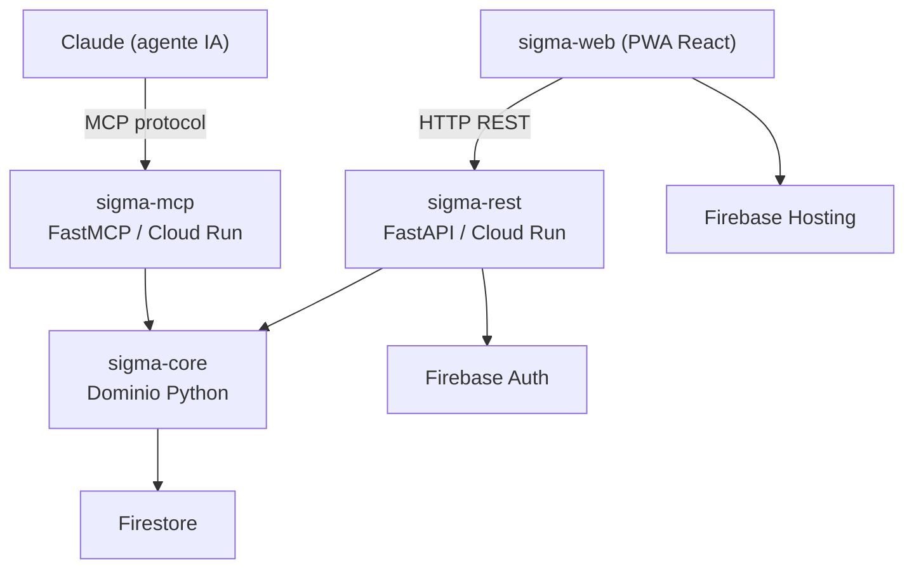
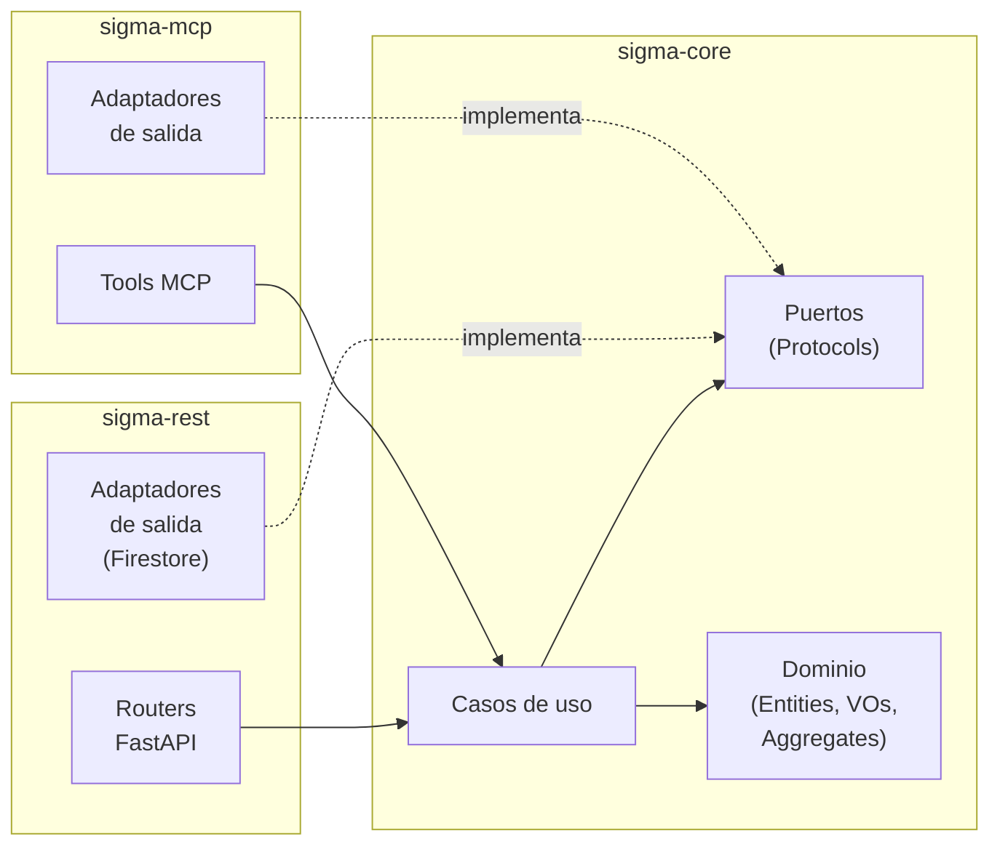
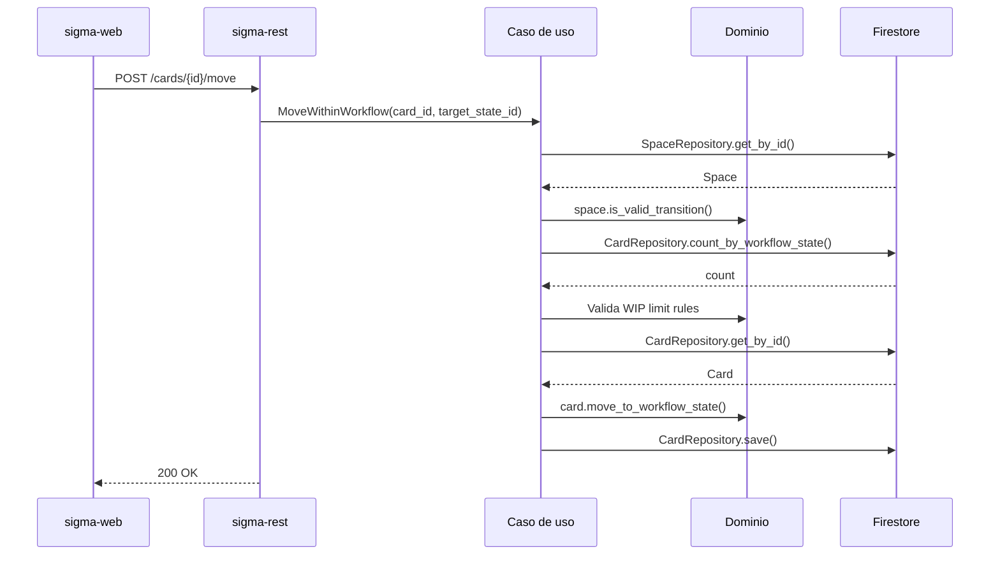
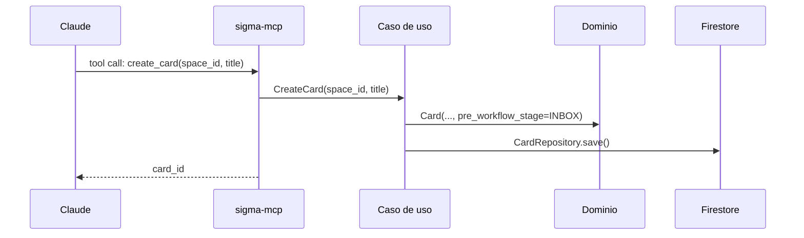
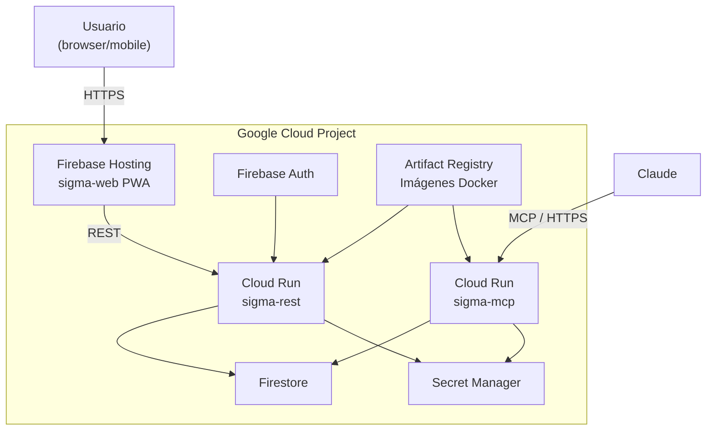

# ARCHITECTURE.md

## SIGMA — Arquitectura del sistema

**Versión:** 1.0
**Fecha:** 2026-03-21
**Estado:** Activo

---

## Índice

1. [Visión general](#1-visión-general)
2. [Principios arquitectónicos](#2-principios-arquitectónicos)
3. [Estructura del repositorio](#3-estructura-del-repositorio)
4. [Bounded Contexts](#4-bounded-contexts)
5. [Capas y dependencias](#5-capas-y-dependencias)
6. [Componentes y responsabilidades](#6-componentes-y-responsabilidades)
7. [Flujo de datos](#7-flujo-de-datos)
8. [Infraestructura GCP](#8-infraestructura-gcp)
9. [Decisiones arquitectónicas](#9-decisiones-arquitectónicas)

---

## 1. Visión general

SIGMA es una aplicación personal de productividad que gestiona tareas mediante un sistema de tablero configurable con workflow de estados. Está diseñada para ser accesible desde un agente de IA (Claude vía MCP) y desde una interfaz web (PWA).



---

## 2. Principios arquitectónicos

### Hexagonal Architecture (Ports & Adapters)

El dominio no conoce la infraestructura. `sigma-core` define interfaces (puertos); los adaptadores (`sigma-mcp`, `sigma-rest`) las implementan. El dominio es testeable en aislamiento sin base de datos ni framework.

```
[Adaptadores de entrada] → [Casos de uso] → [Dominio] → [Puertos] → [Adaptadores de salida]
```

### Domain-Driven Design (DDD)

El modelo de dominio refleja el lenguaje ubicuo del negocio. Las reglas de negocio viven en el dominio, no en los adaptadores. Los Aggregate Roots protegen sus invariantes.

### Principios aplicados

| Principio | Aplicación |
|---|---|
| **SRP** | Cada clase tiene una única razón para cambiar |
| **DIP** | El dominio depende de abstracciones (Protocols), nunca de infraestructura concreta |
| **CQS** | Commands mutan estado y no retornan datos; Queries retornan datos y no mutan estado |
| **Fail Fast** | Los Value Objects validan en construcción; el sistema falla en el borde, no en el centro |
| **YAGNI** | Solo se modela lo necesario para v1; Planning se difiere a v2 |

---

## 3. Estructura del repositorio

Mono-repo con uv workspaces (ADR-001).

```
sigma/
├── packages/
│   ├── sigma-core/          # Dominio + puertos (Python)
│   │   ├── src/sigma_core/
│   │   │   └── task_management/
│   │   │       ├── domain/
│   │   │       ├── ports/
│   │   │       └── use_cases/
│   │   ├── tests/
│   │   └── pyproject.toml
│   │
│   ├── sigma-mcp/           # Adaptador MCP (Python)
│   │   ├── src/sigma_mcp/
│   │   ├── tests/
│   │   └── pyproject.toml
│   │
│   ├── sigma-rest/          # Adaptador REST + adaptadores de salida (Python)
│   │   ├── src/sigma_rest/
│   │   │   ├── api/         # Routers FastAPI
│   │   │   ├── adapters/    # Implementaciones de repositorios (Firestore)
│   │   │   └── config/
│   │   ├── tests/
│   │   └── pyproject.toml
│   │
│   └── sigma-web/           # PWA React
│       ├── src/
│       └── package.json
│
├── docs/
│   ├── adr/                 # Architecture Decision Records
│   └── ARCHITECTURE.md      # Este documento
│
├── pyproject.toml           # Raíz uv workspace
└── uv.lock
```

---

## 4. Bounded Contexts

### v1 — TaskManagement (único contexto activo)

Gestiona el ciclo de vida de las tareas: creación, estados, clasificación y relaciones.

**Aggregates:**
- `Space` — contiene y protege el workflow configurable
- `Card` — tarea concreta con ciclo de vida propio

**Entidades independientes:**
- `Area` — responsabilidad continua (PARA)
- `Project` — esfuerzo finito con resultado (PARA)
- `Epic` — contenedor de agrupación de Cards

### v2 — Planning (diferido)

Timeboxing, estimaciones y tracking temporal. Se implementará como módulo independiente dentro de `sigma-core` bajo `sigma_core/planning/` cuando existan casos de uso concretos que lo justifiquen.

---

## 5. Capas y dependencias

Las dependencias solo apuntan hacia el interior. El dominio no importa nada externo.



**Regla de dependencia:** `sigma-mcp` y `sigma-rest` dependen de `sigma-core`. `sigma-core` no conoce ni `sigma-mcp` ni `sigma-rest`.

---

## 6. Componentes y responsabilidades

### sigma-core

Dominio puro. Sin frameworks, sin infraestructura.

| Módulo | Responsabilidad |
|---|---|
| `domain/` | Aggregates, entidades, Value Objects, enums, errores de dominio |
| `domain/card_filter.py` | Motor de predicados reutilizable (visualización + WIP limits) |
| `ports/` | Interfaces de repositorios como Python Protocols |
| `use_cases/` | Coordinación de operaciones de dominio (Commands y Queries) |
| `handlers.py` | Mapeo `SigmaDomainError → ErrorResult` — agnóstico al protocolo |

Los casos de uso reciben sus dependencias por **constructor injection**.
`sigma-core` no conoce Pydantic, FastAPI ni MCP.

**Dependencias:** stdlib únicamente.

### sigma-rest

Adaptador REST + implementaciones de repositorios en Firestore.

| Módulo | Responsabilidad |
|---|---|
| `api/` | Routers FastAPI, manejo de errores HTTP |
| `schemas/` | Pydantic models para request/response — contratos REST |
| `mappers/` | Conversión `Card → CardResponse`, `CreateCardRequest → CreateCardCommand` |
| `adapters/` | Implementaciones de `CardRepository`, `SpaceRepository`, etc. sobre Firestore |
| `config/` | `pydantic-settings` con prefijo `FIRESTORE_`, `APP_` |

**Dependencias:** `fastapi`, `firebase-admin`, `pydantic-settings`, `sigma-core`.

### sigma-mcp

Adaptador MCP para integración con Claude.

| Módulo | Responsabilidad |
|---|---|
| `tools/` | Funciones decoradas con `@mcp.tool()` que envuelven casos de uso |
| `schemas/` | Estructuras de datos para tools MCP |
| `mappers/` | Conversión dominio ↔ protocolo MCP |
| `adapters/` | Implementaciones de repositorios Firestore |

**Dependencias:** `mcp[cli]`, `sigma-core`.

### sigma-web

PWA React. Independiente del workspace uv.

| Módulo | Responsabilidad |
|---|---|
| `src/` | Componentes React, lógica de estado, llamadas REST |

**Dependencias:** React, Firebase SDK (Auth).

---

## 7. Flujo de datos

### Operación típica desde la PWA



### Operación típica desde Claude (MCP)



---

## 8. Infraestructura GCP

Stack completo dentro del free tier permanente (ADR-002).



| Componente | Producto | Free tier |
|---|---|---|
| API REST | Cloud Run | 2M requests/mes |
| Servidor MCP | Cloud Run | 2M requests/mes |
| Base de datos | Firestore | 50K reads, 20K writes/día |
| Autenticación | Firebase Auth | Ilimitado |
| Hosting PWA | Firebase Hosting | 10GB |
| Secretos | Secret Manager | 6 versiones activas |
| Imágenes Docker | Artifact Registry | 0.5GB |

**Gestión de configuración:** `pydantic-settings` con variables de entorno. Secret Manager en producción con inyección nativa en Cloud Run. `.env` en local (ADR-004).

---

## 9. Decisiones arquitectónicas

Las decisiones significativas están documentadas como ADRs en `docs/adr/`.

| ADR | Título | Estado |
|---|---|---|
| ADR-001 | Estructura del repositorio — mono-repo con uv workspaces | Aceptado |
| ADR-002 | Stack de infraestructura — GCP free tier | Aceptado |
| ADR-003 | Base de datos — Firestore | Superseded (pendiente revisión) |
| ADR-004 | Gestión de secretos — Secret Manager + pydantic-settings | Aceptado |
| ADR-005 | Comunicación — FastMCP + FastAPI | Aceptado |
| ADR-006 | Bounded Context único para v1 | Aceptado |
| ADR-007 | Space como Aggregate Root del Workflow | Aceptado |
| ADR-008 | Card como Aggregate Root independiente | Aceptado |
| ADR-009 | PreWorkflowStage como enum fijo de sistema | Aceptado |
| ADR-010 | WIP limit validado en capa de caso de uso | Aceptado |
| ADR-011 | Area y Project como entidades PARA opcionales | Aceptado |
| ADR-012 | Column es concepto de presentación, no entidad de dominio | Aceptado |
