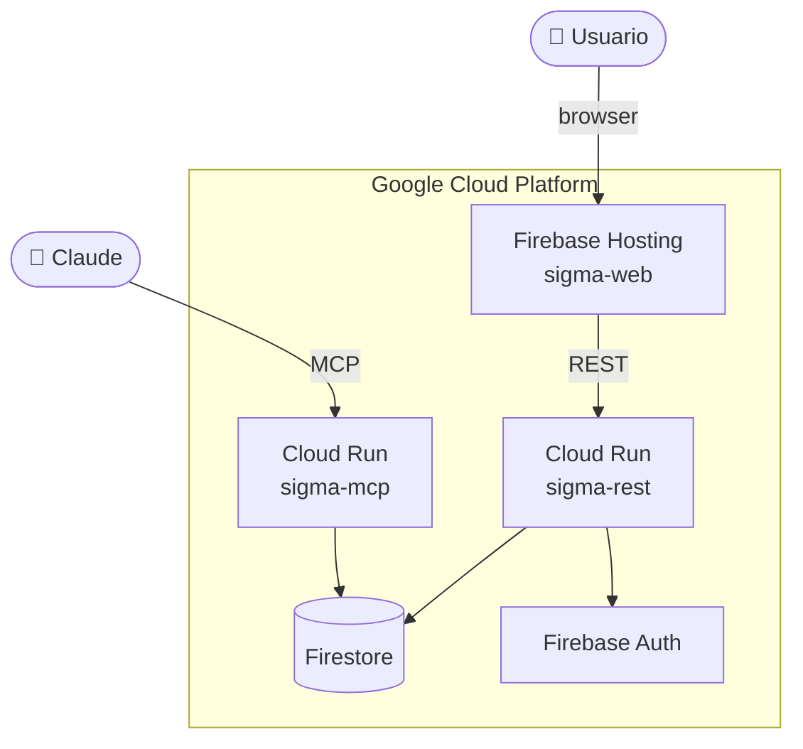

# SIGMA

Sistema personal de gestión de tareas con workflow configurable, integración con Claude vía MCP y acceso web mediante PWA.

---

## ¿Qué es SIGMA?

SIGMA reemplaza Trello + Planyway como sistema central de productividad personal. Combina un tablero Kanban con workflow configurable (estados, transiciones, WIP limits), clasificación PARA (Areas y Proyectos), y acceso desde Claude como agente de IA.

**Características principales:**

- **Tablero configurable** — define tus propios estados, transiciones y reglas WIP limit
- **Pre-workflow fijo** — Inbox → Refinement → Backlog como etapas universales de captura
- **Clasificación PARA** — Areas, Proyectos y Epics para organizar el trabajo por contexto
- **Acceso dual** — interfaz web PWA y agente Claude vía MCP desde la misma base de dominio
- **CardFilter** — motor de predicados para filtrar y visualizar cards en tablero y WIP limits
- **GCP free tier** — coste efectivo $0/mes para uso personal

---

## Estructura del repositorio

```
sigma/
├── README.md                        ← este fichero
├── ARCHITECTURE.md                  ← visión arquitectónica de referencia
├── pyproject.toml                   ← uv workspace raíz
├── uv.lock
│
├── packages/
│   ├── sigma-core/                  ← núcleo: dominio + repositorios Firestore (Python)
│   ├── sigma-mcp/                   ← adaptador MCP para Claude (Python) — v4, esqueleto
│   ├── sigma-rest/                  ← adaptador REST (FastAPI) — consume sigma-core (Python)
│   └── sigma-web/                   ← PWA React + Vite
│
└── docs/
    ├── adr/                         ← Architecture Decision Records
    │   ├── ADR-001_-_Estructura_del_repositorio.md
    │   ├── ADR-002_-_Stack_de_infraestructura_GCP.md
    │   ├── ADR-003_-_Base_de_datos_Firestore.md
    │   ├── ADR-004_-_Gestion_de_secretos.md
    │   ├── ADR-005_-_Comunicacion_entre_componentes.md
    │   ├── ADR-006_-_Bounded_Context.md
    │   ├── ADR-007_-_Space_Aggregate_Root.md
    │   ├── ADR-008_-_Card_Aggregate_Root.md
    │   ├── ADR-009_-_PreWorkflowStage.md
    │   ├── ADR-010_-_WIP_Limit.md
    │   ├── ADR-011_-_Area_Project_PARA.md
    │   └── ADR-012_-_Column_Presentacion.md
    │
    └── design/
        ├── DOMAIN-DESIGN.md             ← modelo de dominio completo
        ├── FIRESTORE-DESIGN.md          ← colecciones, índices, fanout
        ├── UI-DESIGN.md                 ← wireframes y flujos de interfaz
        ├── COMMUNICATION-FLOWS.md       ← sequence diagrams de casos de uso
        ├── ARCHITECTURE-DIAGRAM.md      ← diagramas de arquitectura
        ├── API-REST-CATALOGUE.md        ← contratos REST completos
        └── MCP-TOOLS-CATALOGUE.md       ← tools MCP expuestas a Claude
```

---

## Stack técnico

| Capa | Tecnología |
|---|---|
| Dominio | Python 3.13 — sin frameworks en la capa de negocio |
| Repositorios | `firebase-admin` (Firestore async) — en `sigma-core/infrastructure/` |
| API REST | FastAPI + Uvicorn |
| Servidor MCP | FastMCP (`mcp[cli]`) — planificado v4 |
| Base de datos | Firestore (GCP) — emulador Docker en desarrollo local |
| Autenticación | Firebase Auth (Google OAuth) — pendiente integración |
| PWA | React 19 + Vite + React Query + Zustand + dnd-kit |
| Hosting | Firebase Hosting |
| Compute | Cloud Run (containerizado) |
| Secretos | Secret Manager |
| Gestión de paquetes Python | uv workspaces |

---

## Arquitectura en una imagen



Para la arquitectura completa con todas las capas, dependencias e infraestructura → [`ARCHITECTURE.md`](./ARCHITECTURE.md)

---

## Quickstart

### Requisitos previos

- Python 3.13+
- [uv](https://docs.astral.sh/uv/) instalado
- Node.js 20+ (para `sigma-web`)
- Proyecto GCP con Firestore, Firebase Auth y Secret Manager habilitados
- Firebase CLI instalado

### Instalación

```bash
# Clonar el repositorio
git clone <repo-url>
cd sigma

# Instalar todas las dependencias Python
uv sync

# Instalar dependencias de sigma-web
cd packages/sigma-web
npm install
```

### Configuración local

Crea un fichero `.env` en `sigma-rest` a partir de su `.env.example`:

```bash
cp packages/sigma-rest/.env.example packages/sigma-rest/.env
```

Variables mínimas necesarias:

```bash
# packages/sigma-rest/.env
FIRESTORE_PROJECT_ID=<tu-gcp-project-id>
FIRESTORE_DATABASE=(default)
FIRESTORE_EMULATOR_HOST=localhost:8081   # solo en desarrollo local
```

### Firestore en local

Para desarrollo local se usa el emulador oficial de Firestore vía Docker:

```bash
# Arrancar emulador Firestore
docker-compose up firestore

# El emulador expone la UI en http://localhost:4000
```

La variable `FIRESTORE_EMULATOR_HOST` hace que `firebase-admin` apunte al emulador
en lugar de a GCP real — sin necesidad de service account.

### Ejecutar en local

```bash
# API REST (incluye sigma-core con repositorios Firestore)
cd packages/sigma-rest
uv run uvicorn sigma_rest.main:app --reload --port 8000

# PWA
cd packages/sigma-web
npm run dev
```

> `sigma-mcp` no está implementado todavía (planificado para v4).

---

## Desarrollo

### Tests

```bash
# Tests de dominio (sigma-core)
cd packages/sigma-core
uv run pytest

# Tests de integración (sigma-rest)
cd packages/sigma-rest
uv run pytest
```

### Convenciones

- **TDD/BDD** — todo código de producción tiene test. Ciclo Rojo → Verde → Refactor
- **Commits** — formato convencional: `feat:`, `fix:`, `test:`, `docs:`, `refactor:`
- **ADRs** — toda decisión arquitectónica significativa se documenta en `docs/adr/`
- **No hay `sigma-core` sin tests** — el dominio es el núcleo del sistema y debe estar cubierto al 100%

---

## Documentación

| Documento | Descripción |
|---|---|
| [`ARCHITECTURE.md`](./ARCHITECTURE.md) | Principios, capas, componentes y decisiones |
| [`docs/design/DOMAIN-DESIGN.md`](./docs/design/DOMAIN-DESIGN.md) | Modelo de dominio: aggregates, VOs, casos de uso |
| [`docs/design/FIRESTORE-DESIGN.md`](./docs/design/FIRESTORE-DESIGN.md) | Estructura de colecciones, índices y estrategia de escritura |
| [`docs/design/UI-DESIGN.md`](./docs/design/UI-DESIGN.md) | Wireframes y flujos de interfaz |
| [`docs/design/COMMUNICATION-FLOWS.md`](./docs/design/COMMUNICATION-FLOWS.md) | Sequence diagrams de los casos de uso principales |
| [`docs/design/ARCHITECTURE-DIAGRAM.md`](./docs/design/ARCHITECTURE-DIAGRAM.md) | Diagramas completos de arquitectura e infraestructura |
| [`docs/design/API-REST-CATALOGUE.md`](./docs/design/API-REST-CATALOGUE.md) | Contratos de la API REST (endpoints, request/response) |
| [`docs/design/MCP-TOOLS-CATALOGUE.md`](./docs/design/MCP-TOOLS-CATALOGUE.md) | Tools MCP expuestas a Claude — diseño para v4 |
| [`docs/adr/`](./docs/adr/) | Architecture Decision Records |

---

## Roadmap

### v1 — TaskManagement

- [x] Diseño de dominio (Aggregates, VOs, CardFilter, ADRs)
- [x] `sigma-core` — dominio, casos de uso, repositorios Firestore
- [x] `sigma-rest` — API REST completa (FastAPI)
- [x] `sigma-web` — PWA React (tablero Triage, vistas PARA, drag-and-drop)
- [ ] Autenticación Firebase Auth (pendiente integración)
- [ ] Seed script con datos de ejemplo
- [ ] Despliegue en Cloud Run + Firebase Hosting

### v2 — Planning (Scheduling)

- [ ] Bounded Context `Planning` (timeboxing, estimaciones, tracking)
- [ ] Integración con Google Calendar
- [ ] Offline support en PWA

### v3 — Metrics

- [ ] Bounded Context `Metrics` — análisis de productividad, velocidad, tendencias

### v4 — MCP (Claude agent)

- [ ] `sigma-mcp` — servidor FastMCP con tools que envuelven los casos de uso de sigma-core
---

## Licencia

Proyecto personal. Sin licencia de distribución.
