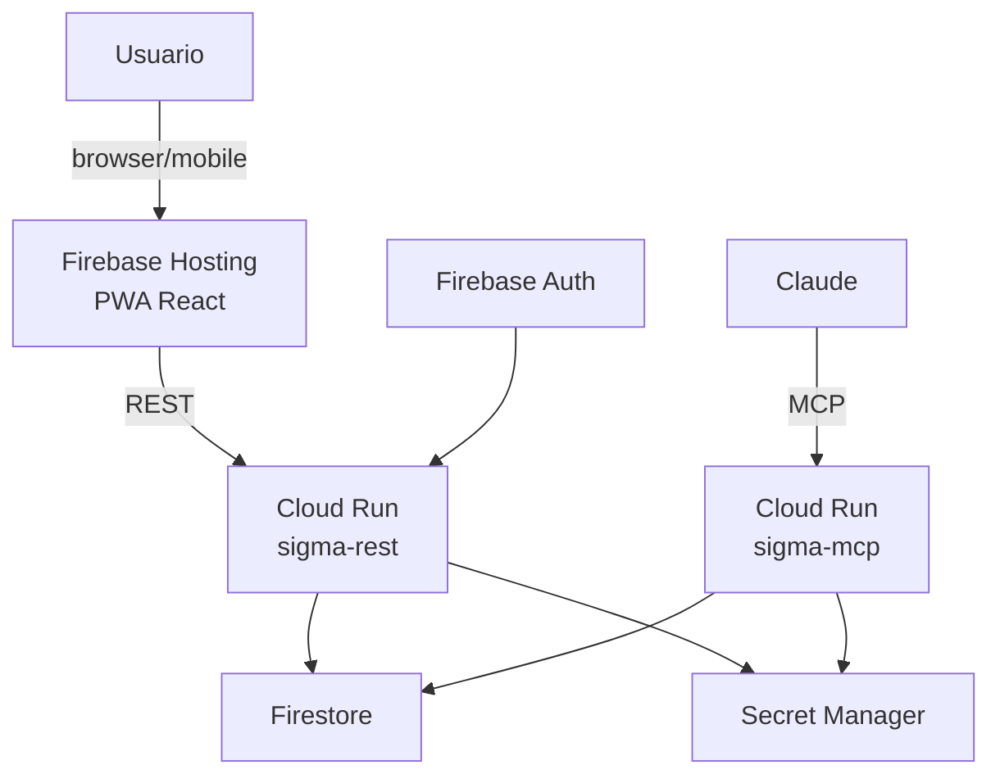

# ADR-002: Stack de infraestructura — GCP free tier

**Estado:** Aceptado
**Fecha:** 2026-03-21

## Contexto

SIGMA es un proyecto personal que debe mantenerse dentro del
free tier de GCP indefinidamente. El autor tiene conocimiento
profundo de GCP, lo que elimina la curva de aprendizaje.

## Decisión

Stack GCP completo dentro del free tier permanente:

| Componente | Producto GCP | Free tier |
|---|---|---|
| API REST + MCP | Cloud Run | 2M requests/mes |
| Base de datos | Firestore | 50K reads, 20K writes/día |
| Autenticación | Firebase Auth | Ilimitado |
| UI web/mobile | Firebase Hosting | 10GB hosting |
| Secretos | Secret Manager | 6 versiones activas |
| Imágenes Docker | Artifact Registry | 0.5GB |

## Razonamiento

- Conocimiento profundo del autor en GCP — cero curva de
  aprendizaje
- Todos los productos tienen free tier permanente adecuado
  al volumen de uso personal
- Stack coherente dentro de un único proyecto GCP
- Alineado con certificaciones en curso (PCD, PSOE)
- PWA sobre Firebase Hosting elimina la necesidad de publicar
  en App Store manteniendo acceso móvil

## Alternativas consideradas

- **Supabase**: PostgreSQL con free tier, pero sale del ecosistema
  GCP y añade dependencia externa. Descartado.
- **Cloud SQL**: potente pero sin free tier permanente (~$7/mes
  mínimo). Descartado.
- **App nativa iOS/Android**: requiere cuenta de desarrollador
  de pago y publicación en stores. Descartado — PWA cubre
  las necesidades de acceso móvil.

## Consecuencias

- Coste efectivo $0/mes para uso personal
- Requiere cuenta GCP con billing habilitado (necesario para
  Secret Manager aunque el uso sea gratuito)
- Cold start de 2-4s en Cloud Run tras inactividad —
  aceptable para uso interactivo personal