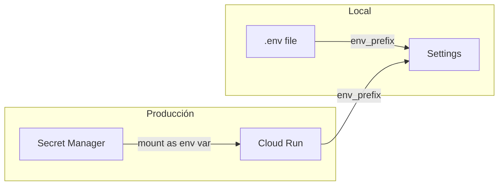

# ADR-004: Gestión de secretos — Secret Manager + pydantic-settings

**Estado:** Aceptado
**Fecha:** 2026-03-21

## Contexto

`sigma-mcp` y `sigma-rest` necesitan credenciales de acceso
a Firestore y otros servicios GCP. Deben estar disponibles
en local y en producción sin cambios en el código.

## Decisión

GCP Secret Manager en producción con inyección nativa en
Cloud Run. `pydantic-settings` como capa de configuración
unificada. `.env` para desarrollo local (gitignoreado).


Cada package define su propia clase Settings con su prefijo:
```python
from pydantic_settings import BaseSettings

class FirestoreSettings(BaseSettings):
    project_id: str
    database: str

    model_config = {
        "env_file": ".env",
        "env_prefix": "FIRESTORE_",
    }
```

## Alternativas consideradas

- **Variables de entorno de Cloud Run directamente**: visibles
  en texto plano en la consola de GCP. Descartado por seguridad.
- **Secret Manager con SDK directo**: requiere código específico
  de GCP. Descartado — la inyección nativa de Cloud Run
  elimina esa dependencia.

## Consecuencias

- Credenciales nunca en texto plano en ninguna interfaz
- Cero código específico de GCP en la aplicación
- `.env.example` en cada package documenta las variables
- Rotación de secretos sin redespliegue
- Falla rápido al arrancar si falta alguna variable