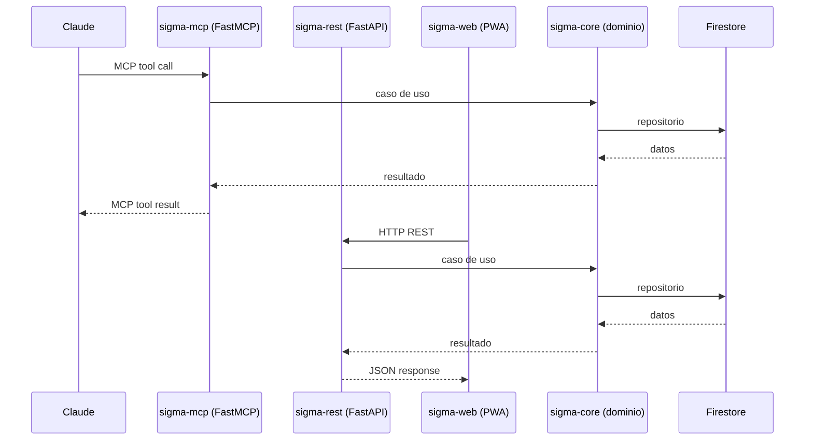

# ADR-005: Comunicación — FastMCP + FastAPI

**Estado:** Aceptado
**Fecha:** 2026-03-21

## Contexto

SIGMA tiene dos puntos de entrada distintos con protocolos
distintos que comparten el mismo dominio:
- Claude accede via protocolo MCP
- La PWA accede via REST

## Decisión

`sigma-mcp` usa FastMCP (SDK oficial `mcp[cli]`) con
Streamable HTTP. `sigma-rest` usa FastAPI. Ambos consumen
`sigma-core` como dominio compartido.

## Razonamiento

FastMCP abstrae el protocolo MCP — solo se necesita decorar
funciones con `@mcp.tool()`. FastAPI es el estándar de facto
para APIs REST en Python async. Ambos son async nativos y
compatibles con el mismo dominio.

## Alternativas consideradas

- **Un único servidor que sirva MCP y REST**: mezcla
  responsabilidades y protocolos en un único proceso.
  Descartado — despliegues independientes y separación
  de responsabilidades.
- **gRPC para comunicación interna**: innecesario para
  un proyecto personal sin microservicios reales. Descartado.

## Consecuencias

- `sigma-mcp` y `sigma-rest` se despliegan como servicios
  independientes en Cloud Run
- El dominio en `sigma-core` no conoce ni FastMCP ni FastAPI
- Cambios en el protocolo MCP están acotados a `sigma-mcp`
- Cambios en la API REST están acotados a `sigma-rest`
- Escalado independiente de cada servicio si fuera necesario