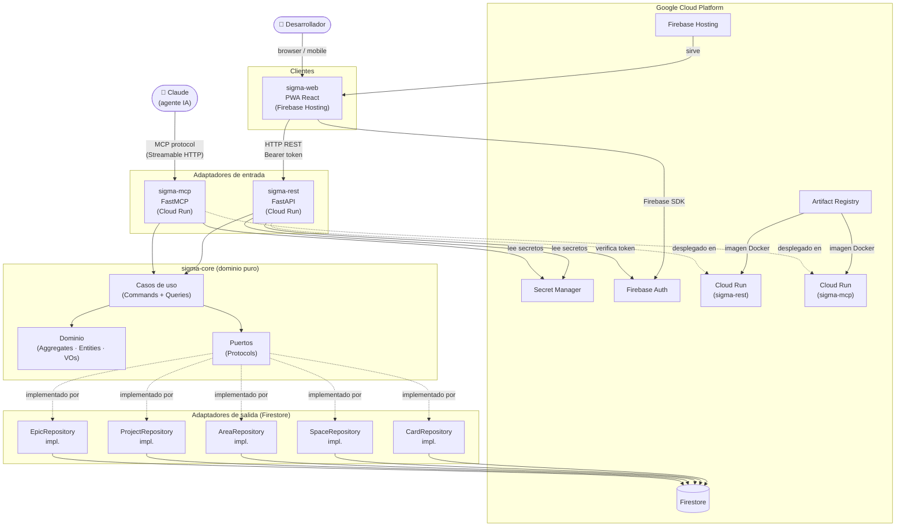
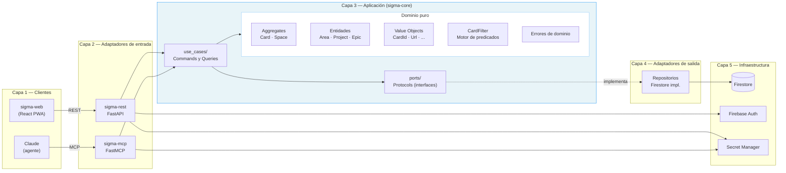
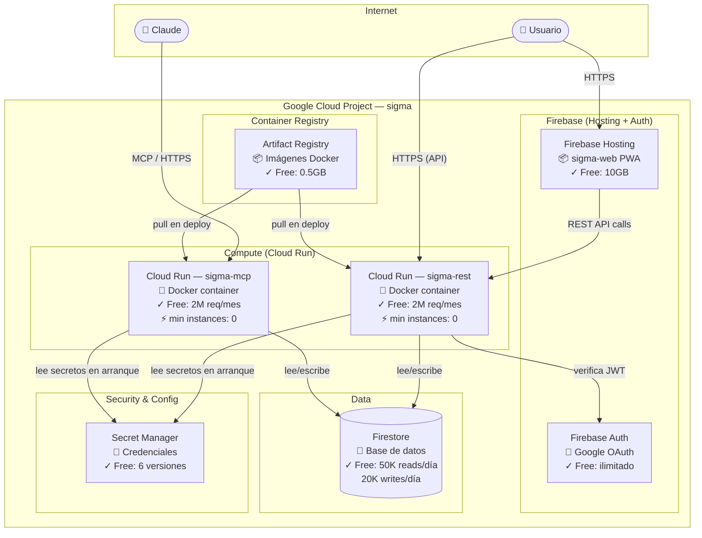
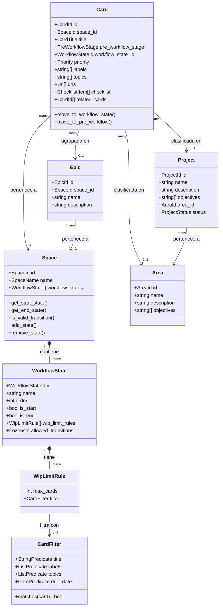
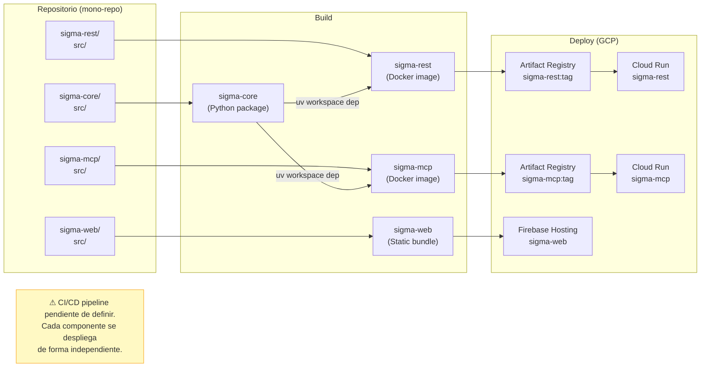

# ARCHITECTURE-DIAGRAM.md

## SIGMA — Diagrama de arquitectura completo

**Versión:** 1.0
**Fecha:** 2026-03-21

---

## Índice

1. [Vista de sistema completo](#1-vista-de-sistema-completo)
2. [Vista de capas y dependencias](#2-vista-de-capas-y-dependencias)
3. [Vista de infraestructura GCP](#3-vista-de-infraestructura-gcp)
4. [Vista de dominio](#4-vista-de-dominio)
5. [Vista de despliegue](#5-vista-de-despliegue)

---

## 1. Vista de sistema completo

Todos los actores, componentes y dependencias en un único diagrama de referencia.

---

## 2. Vista de capas y dependencias

Regla fundamental: **las dependencias solo apuntan hacia el interior**. El dominio no conoce nada externo.

---

## 3. Vista de infraestructura GCP

Todos los recursos GCP con sus relaciones y el free tier de cada uno.

---

## 4. Vista de dominio

Aggregates, entidades y sus relaciones en el Bounded Context TaskManagement.

---

## 5. Vista de despliegue

Cómo los componentes se empaquetan y despliegan.

> **Nota sobre CI/CD:** el pipeline de integración y despliegue continuo queda fuera del alcance de v1. Cuando se defina, cada componente (`sigma-rest`, `sigma-mcp`, `sigma-web`) tendrá su propio pipeline de build, test y deploy independiente, reflejando los ciclos de despliegue separados establecidos en ADR-001.
