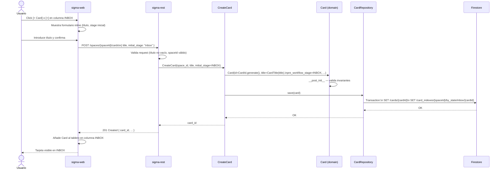
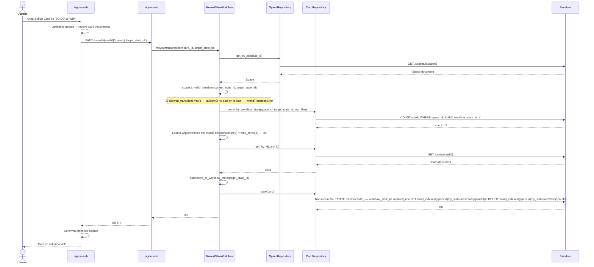
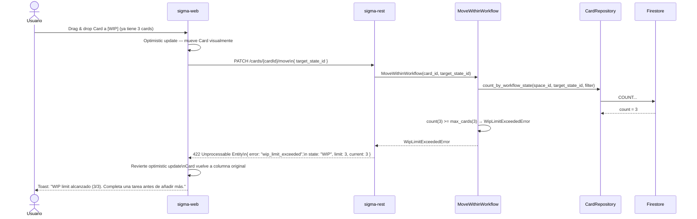
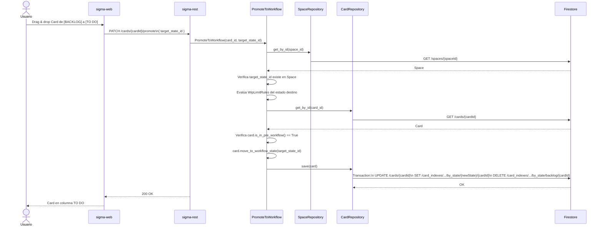
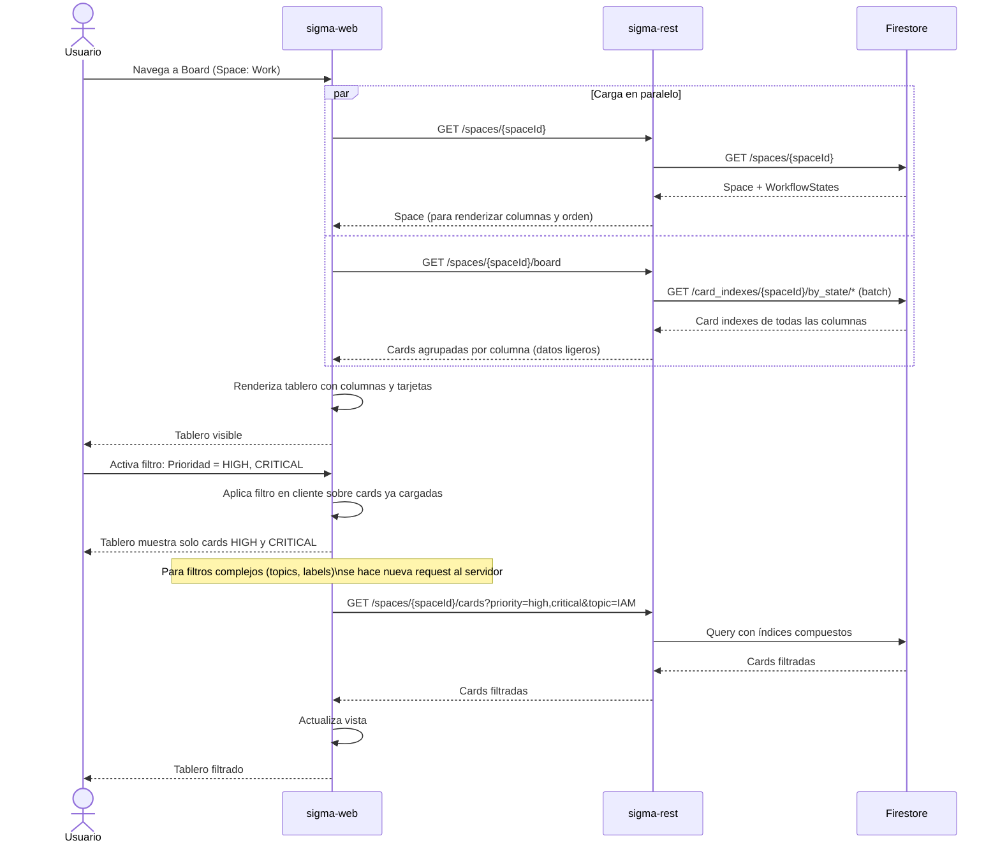
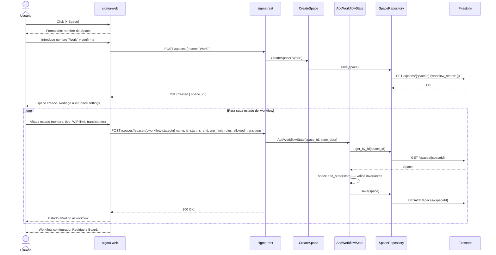
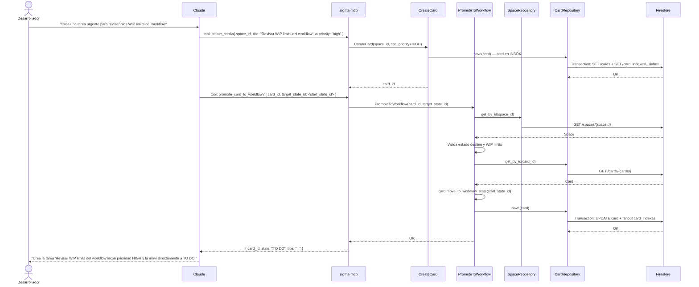
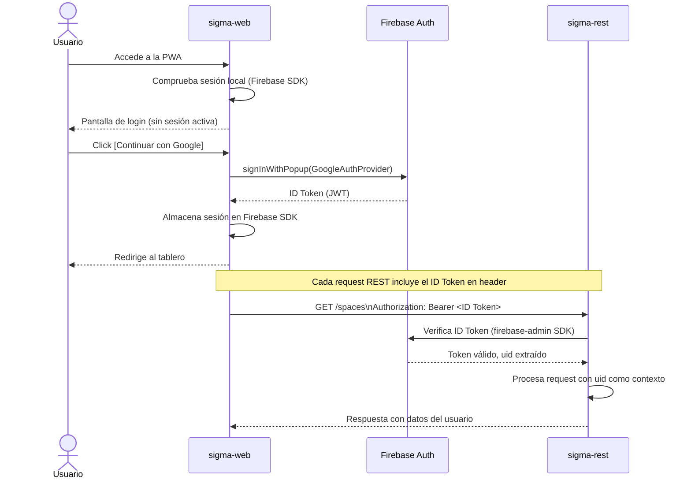

# COMMUNICATION-FLOWS.md

## SIGMA — Flujos de comunicación

**Versión:** 1.0
**Fecha:** 2026-03-21

---

## Índice

1. [Crear Card](#1-crear-card)
2. [Mover Card dentro del Workflow](#2-mover-card-dentro-del-workflow)
3. [Promover Card al Workflow](#3-promover-card-al-workflow)
4. [WIP limit excedido](#4-wip-limit-excedido)
5. [Vista de tablero con filtro](#5-vista-de-tablero-con-filtro)
6. [Crear Space con Workflow](#6-crear-space-con-workflow)
7. [Operación desde Claude (MCP)](#7-operación-desde-claude-mcp)
8. [Autenticación](#8-autenticación)

---

## 1. Crear Card

Caso base: Card nueva desde el tablero, entra en INBOX.

---

## 2. Mover Card dentro del Workflow

Incluye validación de transición y WIP limits.

---

## 4. WIP limit excedido

El servidor rechaza el movimiento y el cliente revierte el optimistic update.

---

## 3. Promover Card al Workflow

Card en BACKLOG → primer estado del workflow (o estado de entrada urgente).

---

## 5. Vista de tablero con filtro

Carga inicial del tablero y aplicación de filtro.

---

## 6. Crear Space con Workflow

Configuración inicial de un nuevo Space.

---

## 7. Operación desde Claude (MCP)

Claude crea una Card y la promueve al workflow en una conversación.

---

## 8. Autenticación

Flujo de login inicial — Firebase Auth con Google.

