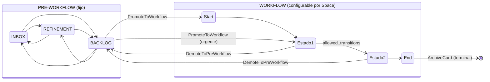

# SIGMA — Diseño del Dominio (sigma-core)

**Estado:** Borrador — pendiente de revisión
**Fecha:** 2026-03-21
**Bounded Context:** TaskManagement (v1)

---

## Índice

1. [Enums de sistema](#1-enums-de-sistema)
2. [Value Objects](#2-value-objects)
3. [Aggregates y Entidades](#3-aggregates-y-entidades)
4. [CardFilter — Motor de predicados](#4-cardfilter--motor-de-predicados)
5. [Puertos](#5-puertos)
6. [Casos de uso](#6-casos-de-uso)
7. [Flujo de estados](#7-flujo-de-estados)
8. [Errores de dominio](#8-errores-de-dominio)
9. [Estructura de paquetes](#9-estructura-de-paquetes)

---

## 1. Enums de sistema

Fijos, definidos por el sistema. No configurables por el usuario.

### PreWorkflowStage
| Valor | Semántica |
|---|---|
| `inbox` | Idea capturada, sin depurar |
| `refinement` | Creada, falta información |
| `backlog` | Lista para iniciar el workflow |

### Priority
`low` · `medium` · `high` · `critical`

### ProjectStatus
`active` · `on_hold` · `completed`

---

## 2. Value Objects

Todos los Value Objects son:
- **Inmutables** — no se modifican tras su creación
- **Identidad por valor** — dos VOs con el mismo valor son iguales
- **Fail Fast** — validan en construcción, rechazan valores inválidos

### Identificadores

Todos siguen el mismo patrón: string UUID v4 válido.

| Value Object | Entidad que identifica |
|---|---|
| `CardId` | Card |
| `SpaceId` | Space |
| `WorkflowStateId` | WorkflowState |
| `AreaId` | Area |
| `ProjectId` | Project |
| `EpicId` | Epic |

**Invariante común:** debe ser un UUID v4 válido. Falla en construcción si no lo es.
Todos exponen un método de fábrica `generate()` que crea un nuevo UUID v4.

### Strings con invariantes

| Value Object | Invariante |
|---|---|
| `CardTitle` | 1–255 caracteres, sin espacios al inicio/fin |
| `SpaceName` | 1–100 caracteres, sin espacios al inicio/fin |

### Url

Representa una URL válida con esquema `http` o `https`.

**Invariante:** debe tener esquema http/https y dominio presente. Falla en construcción si no es una URL bien formada.

### ChecklistItem

Representa un ítem de checklist con texto y estado de completado.

| Campo | Tipo | Invariante |
|---|---|---|
| `text` | str | 1–500 caracteres, sin espacios al inicio/fin |
| `done` | bool | — |

Es inmutable — `complete()` y `reopen()` devuelven nuevas instancias, no mutan el objeto.

---

## 3. Aggregates y Entidades

### 3.1 Space (Aggregate Root)

Contiene y protege la coherencia del workflow configurable.
Ningún agente externo puede modificar `WorkflowState` sin pasar por `Space`.

#### WorkflowState (entidad interna de Space)

No tiene identidad fuera de Space.

| Campo | Tipo | Descripción |
|---|---|---|
| `id` | `WorkflowStateId` | |
| `name` | `str` | Nombre visible |
| `order` | `int` | Posición visual en el tablero |
| `is_start` | `bool` | Estado de entrada al workflow |
| `is_end` | `bool` | Estado terminal |
| `wip_limit_rules` | `list[WipLimitRule]` | Vacío = sin límite |
| `allowed_transitions` | `frozenset[WorkflowStateId]` | Vacío si `is_end=True` |

#### Space

| Campo | Tipo |
|---|---|
| `id` | `SpaceId` |
| `name` | `SpaceName` |
| `workflow_states` | `list[WorkflowState]` ordenado por `order` |
| `created_at` | `datetime` |
| `updated_at` | `datetime` |

**Invariantes:**
- Exactamente un `WorkflowState` con `is_start=True`
- Exactamente un `WorkflowState` con `is_end=True`
- Toda `WorkflowStateId` en `allowed_transitions` debe existir en el mismo Space

**Comportamiento:**
- `add_state(state)` — añade estado, valida invariantes
- `remove_state(state_id)` — elimina estado; no permite eliminar Start ni End
- `update_state(state)` — modifica estado, revalida invariantes
- `get_start_state()` → `WorkflowState`
- `get_end_state()` → `WorkflowState`
- `get_state(state_id)` → `WorkflowState | None`
- `is_valid_transition(from_id, to_id)` → `bool`

---

### 3.2 Card (Aggregate Root)

| Campo | Tipo | Notas |
|---|---|---|
| `id` | `CardId` | |
| `space_id` | `SpaceId` | Referencia por ID (ADR-008) |
| `title` | `CardTitle` | |
| `description` | `str \| None` | |
| `pre_workflow_stage` | `PreWorkflowStage \| None` | Discriminated union con workflow_state_id |
| `workflow_state_id` | `WorkflowStateId \| None` | Discriminated union con pre_workflow_stage |
| `area_id` | `AreaId \| None` | PARA — opcional |
| `project_id` | `ProjectId \| None` | PARA — opcional |
| `epic_id` | `EpicId \| None` | Agrupación — opcional |
| `priority` | `Priority \| None` | |
| `labels` | `list[str]` | Agrupaciones lógicas, strings libres |
| `topics` | `list[str]` | Tecnologías/habilidades, strings libres |
| `urls` | `list[Url]` | Referencias externas |
| `checklist` | `list[ChecklistItem]` | |
| `related_cards` | `list[CardId]` | Sin semántica de tipo, sin duplicados |
| `due_date` | `date \| None` | |
| `created_at` | `datetime` | |
| `updated_at` | `datetime` | |

**Invariantes:**
- Exactamente uno de `pre_workflow_stage` o `workflow_state_id` debe estar activo
- `related_cards` no puede contener el propio `id` de la Card
- `related_cards` sin duplicados
- `checklist` sin ítems con el mismo texto

**Comportamiento — Stage:**
- `move_to_pre_workflow(stage)` — mueve al pre-workflow, limpia workflow_state_id
- `move_to_workflow_state(state_id)` — mueve al workflow, limpia pre_workflow_stage
  - *Solo valida el estado interno de la Card; la validación de transición y WIP limits es responsabilidad del caso de uso (ADR-010)*

**Comportamiento — Metadata:**
- `update_title(title)` · `update_description(description)` · `update_priority(priority)` · `update_due_date(due_date)`
- `assign_area(area_id)` · `assign_project(project_id, area_id)` · `assign_epic(epic_id)`
  - *Al asignar Project, el caso de uso provee el area_id del Project*

**Comportamiento — Listas:**
- `add_label(label)` / `remove_label(label)` — idempotente en add
- `add_topic(topic)` / `remove_topic(topic)` — idempotente en add
- `add_url(url)` / `remove_url(url)` — idempotente en add
- `add_checklist_item(item)` / `toggle_checklist_item(text)` / `remove_checklist_item(text)`
- `add_related_card(card_id)` / `remove_related_card(card_id)` — valida auto-referencia

**Comportamiento — Query:**
- `is_in_pre_workflow()` → `bool`
- `is_in_workflow()` → `bool`
- `checklist_progress()` → `(completados, total)`

---

### 3.3 Area (Entidad independiente)

Responsabilidad continua sin fecha de fin. No pertenece a ningún AR.

| Campo | Tipo | Notas |
|---|---|---|
| `id` | `AreaId` | |
| `name` | `str` | No vacío |
| `description` | `str \| None` | |
| `objectives` | `list[str]` | Objetivos asociados al área |
| `created_at` | `datetime` | |
| `updated_at` | `datetime` | |

**Comportamiento:** `rename(name)` · `update_description(description)` · `add_objective(text)` · `remove_objective(text)`

---

### 3.4 Project (Entidad independiente)

Esfuerzo finito con resultado. Siempre pertenece a un Area.

| Campo | Tipo | Notas |
|---|---|---|
| `id` | `ProjectId` | |
| `name` | `str` | No vacío |
| `description` | `str \| None` | |
| `objectives` | `list[str]` | Objetivos del proyecto |
| `area_id` | `AreaId` | Obligatorio |
| `status` | `ProjectStatus` | |
| `created_at` | `datetime` | |
| `updated_at` | `datetime` | |

**Invariante:** `area_id` siempre presente — un Project sin Area no puede existir.

**Comportamiento:** `rename(name)` · `update_description(description)` · `add_objective(text)` · `remove_objective(text)` · `change_status(status)` · `reassign_area(area_id)`

---

### 3.5 Epic (Entidad independiente)

Contenedor de agrupación. No entra al tablero, no tiene estado de workflow.

| Campo | Tipo | Notas |
|---|---|---|
| `id` | `EpicId` | |
| `space_id` | `SpaceId` | |
| `name` | `str` | No vacío |
| `description` | `str \| None` | |
| `created_at` | `datetime` | |
| `updated_at` | `datetime` | |

**Comportamiento:** `rename(name)` · `update_description(description)`

---

## 4. CardFilter — Motor de predicados

Concepto de dominio de primer nivel. Reutilizado en:
- **Visualización** — filtrar qué Cards se muestran en el tablero
- **WIP limit rules** — definir el subconjunto al que aplica el límite

Es evaluable en memoria (`matches(card) → bool`). Los adaptadores de Firestore lo traducen a queries nativas.

### Predicados por tipo de campo

| Tipo | Predicados disponibles |
|---|---|
| `str` | `equals` · `not_equals` · `contains` · `not_contains` |
| `list[str]` | `has_any(values)` · `has_all(values)` · `has_none(values)` |
| `numeric` | `eq` · `lte` · `gte` |
| `date` | `eq` · `before` · `after` |

### Campos filtrables de Card

| Campo | Tipo de predicado |
|---|---|
| `title` | string |
| `description` | string |
| `priority` | lista de valores (IN) |
| `labels` | list |
| `topics` | list |
| `area_id` | lista de valores (IN) |
| `project_id` | lista de valores (IN) |
| `epic_id` | lista de valores (IN) |
| `due_date` | date |
| `pre_workflow_stage` | lista de valores (IN) |
| `workflow_state_id` | lista de valores (IN) |

**Combinación:** todos los filtros activos se combinan con AND. Un `CardFilter` vacío pasa todas las Cards.

### WipLimitRule

| Campo | Tipo | Notas |
|---|---|---|
| `max_cards` | `int` | >= 1 |
| `filter` | `CardFilter \| None` | None = aplica a todas las Cards del estado |

**Semántica:** contar las Cards en el estado que pasen el `filter` — ese conteo debe ser < `max_cards`.

---

## 5. Puertos

Protocols de Python — structural subtyping, sin herencia. Viven en `sigma-core`. Las implementaciones viven en los adaptadores (`sigma-rest`, `sigma-mcp`).

### CardRepository
- `save(card)` · `delete(card_id)`
- `get_by_id(card_id)` → `Card | None`
- `get_by_space(space_id, filter?)` → `list[Card]`
- `get_by_pre_workflow_stage(space_id, stage)` → `list[Card]`
- `get_by_workflow_state(space_id, state_id)` → `list[Card]`
- `count_by_workflow_state(space_id, state_id, filter?)` → `int`
- `get_by_area(area_id)` → `list[Card]`
- `get_by_project(project_id)` → `list[Card]`
- `get_by_epic(epic_id)` → `list[Card]`
- `get_by_due_date(predicate)` → `list[Card]`

### SpaceRepository
- `save(space)` · `delete(space_id)`
- `get_by_id(space_id)` → `Space | None`
- `get_all()` → `list[Space]`

### AreaRepository
- `save(area)` · `delete(area_id)`
- `get_by_id(area_id)` → `Area | None`
- `get_all()` → `list[Area]`

### ProjectRepository
- `save(project)` · `delete(project_id)`
- `get_by_id(project_id)` → `Project | None`
- `get_by_area(area_id)` → `list[Project]`
- `get_all()` → `list[Project]`

### EpicRepository
- `save(epic)` · `delete(epic_id)`
- `get_by_id(epic_id)` → `Epic | None`
- `get_by_space(space_id)` → `list[Epic]`

---

## 6. Casos de uso

**Convención CQS:**
- **Command** — muta estado, retorna `None` o el ID creado
- **Query** — no muta estado, retorna datos

### Space

| Caso de uso | Tipo | Descripción |
|---|---|---|
| `CreateSpace(name)` | Command → `SpaceId` | Crea Space con workflow vacío |
| `AddWorkflowState(space_id, state_data)` | Command | Añade estado al workflow |
| `UpdateWorkflowState(space_id, state_id, data)` | Command | Modifica estado existente |
| `RemoveWorkflowState(space_id, state_id)` | Command | Elimina estado; falla si hay Cards activas en él |
| `GetSpace(space_id)` | Query → `Space` | |
| `GetAllSpaces()` | Query → `list[Space]` | |
| `DeleteSpace(space_id)` | Command | Falla si hay Cards activas en el Space |

### Card — Ciclo de vida

| Caso de uso | Tipo | Descripción |
|---|---|---|
| `CreateCard(space_id, title, initial_stage?)` | Command → `CardId` | Por defecto en INBOX; acepta PreWorkflowStage o WorkflowStateId como entrada inicial |
| `PromoteToWorkflow(card_id, target_state_id)` | Command | Pre-workflow → workflow; valida WIP limits |
| `MoveWithinWorkflow(card_id, target_state_id)` | Command | Valida transición permitida y WIP limits |
| `DemoteToPreWorkflow(card_id, stage)` | Command | Devuelve al pre-workflow |
| `ArchiveCard(card_id)` | Command | Mueve al End State del workflow |
| `DeleteCard(card_id)` | Command | Eliminación definitiva |

### Card — Metadata

| Caso de uso | Tipo |
|---|---|
| `UpdateCardTitle(card_id, title)` | Command |
| `UpdateCardDescription(card_id, description)` | Command |
| `UpdateCardPriority(card_id, priority)` | Command |
| `UpdateCardDueDate(card_id, due_date)` | Command |
| `AssignArea(card_id, area_id)` | Command |
| `AssignProject(card_id, project_id)` | Command — extrae area_id del Project automáticamente |
| `AssignEpic(card_id, epic_id)` | Command |

### Card — Contenido

| Caso de uso | Tipo |
|---|---|
| `AddLabel(card_id, label)` / `RemoveLabel(card_id, label)` | Command |
| `AddTopic(card_id, topic)` / `RemoveTopic(card_id, topic)` | Command |
| `AddUrl(card_id, url)` / `RemoveUrl(card_id, url)` | Command |
| `AddChecklistItem(card_id, item)` | Command |
| `ToggleChecklistItem(card_id, text)` | Command |
| `RemoveChecklistItem(card_id, text)` | Command |
| `AddRelatedCard(card_id, related_id)` | Command — bidireccional, persiste en ambas Cards |
| `RemoveRelatedCard(card_id, related_id)` | Command — bidireccional, persiste en ambas Cards |

### Card — Queries

| Caso de uso | Retorno |
|---|---|
| `GetCard(card_id)` | `Card` |
| `GetCardsBySpace(space_id, filter?)` | `list[Card]` |
| `GetCardsByPreWorkflowStage(space_id, stage)` | `list[Card]` |
| `GetCardsByWorkflowState(space_id, state_id)` | `list[Card]` |
| `GetCardsByArea(area_id)` | `list[Card]` |
| `GetCardsByProject(project_id)` | `list[Card]` |
| `GetCardsByEpic(epic_id)` | `list[Card]` |
| `GetCardsByDueDate(predicate)` | `list[Card]` |

### Area · Project · Epic

| Caso de uso | Tipo |
|---|---|
| `CreateArea(name)` | Command → `AreaId` |
| `UpdateArea(area_id, data)` | Command |
| `DeleteArea(area_id)` | Command — Projects y Cards vinculadas quedan huérfanos |
| `GetAllAreas()` | Query → `list[Area]` |
| `CreateProject(name, area_id)` | Command → `ProjectId` |
| `UpdateProject(project_id, data)` | Command |
| `DeleteProject(project_id)` | Command — Cards vinculadas quedan con project_id=None |
| `GetProjectsByArea(area_id)` | Query → `list[Project]` |
| `CreateEpic(space_id, name, description?)` | Command → `EpicId` |
| `UpdateEpic(epic_id, data)` | Command |
| `DeleteEpic(epic_id)` | Command — Cards vinculadas quedan con epic_id=None |
| `GetEpicsBySpace(space_id)` | Query → `list[Epic]` |

---

## 7. Flujo de estados



**Reglas:**
- `CreateCard` entra por defecto en `INBOX`; acepta cualquier stage inicial (caso de incidencia urgente)
- **Transiciones por defecto:** si `allowed_transitions` está vacío en un `WorkflowState`, cualquier movimiento hacia otro estado del mismo Space es válido
- Las transiciones son restrictivas solo cuando `allowed_transitions` tiene valores explícitos
- WIP limits aplican solo a estados del Workflow, no al pre-workflow
- `ArchiveCard` mueve directamente al End State — es el estado terminal
- `DemoteToPreWorkflow` puede sacar una Card del Workflow de vuelta al pre-workflow

---

## 8. Errores de dominio

Todos heredan de `SigmaDomainError`.

| Error | Cuándo se lanza |
|---|---|
| `InvalidWorkflowError` | Invariante de Space violado |
| `StateNotFoundError` | WorkflowStateId no existe en el Space |
| `DuplicateStateError` | Se intenta añadir un estado con ID ya existente |
| `InvalidTransitionError` | Transición no permitida según `allowed_transitions` |
| `WipLimitExceededError` | Conteo de Cards supera el límite de una WipLimitRule |
| `CardNotFoundError` | Card no encontrada en repositorio |
| `SpaceNotFoundError` | Space no encontrado en repositorio |
| `AreaNotFoundError` | Area no encontrada en repositorio |
| `ProjectNotFoundError` | Project no encontrado en repositorio |
| `EpicNotFoundError` | Epic no encontrado en repositorio |
| `DuplicateChecklistItemError` | Checklist item con texto ya existente |

---

## 9. Estructura de paquetes

```
sigma-core/
  src/
    sigma_core/
      task_management/
        domain/
          enums.py              # PreWorkflowStage, Priority, ProjectStatus
          value_objects.py      # CardId, SpaceId, ..., Url, ChecklistItem
          card.py               # Card aggregate
          space.py              # Space aggregate + WorkflowState
          area.py               # Area entity
          project.py            # Project entity
          epic.py               # Epic entity
          card_filter.py        # CardFilter + predicates + WipLimitRule
          errors.py             # Jerarquía de errores de dominio
        ports/
          card_repository.py
          space_repository.py
          area_repository.py
          project_repository.py
          epic_repository.py
        use_cases/
          space/
          card/
          area/
          project/
          epic/
  tests/
    unit/
      domain/
      use_cases/
    integration/
  pyproject.toml
```
